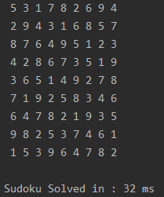
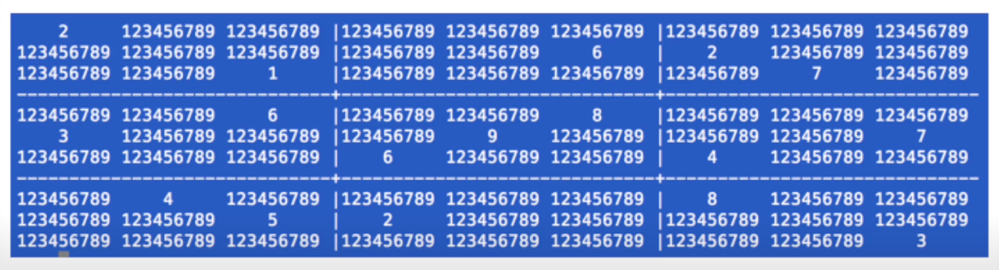
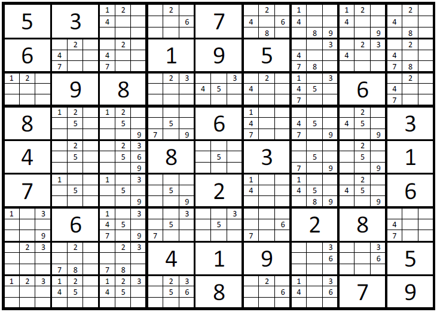
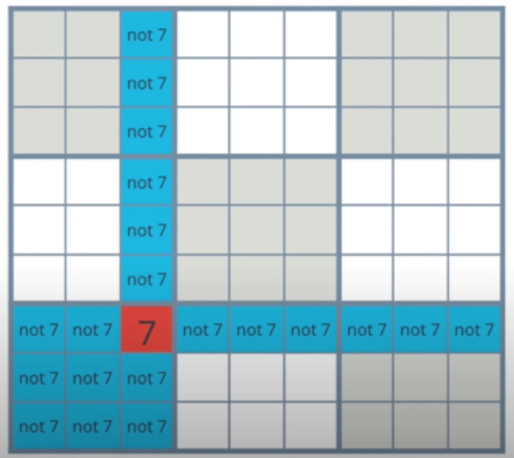
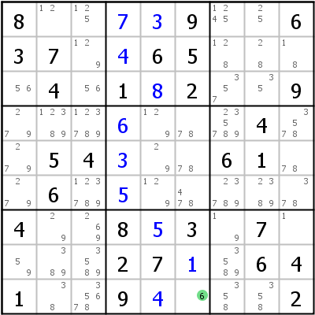
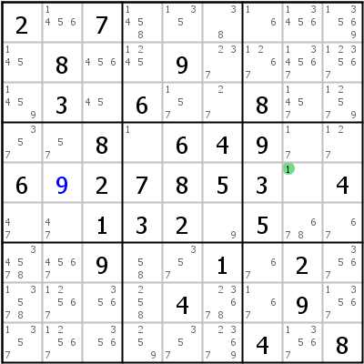
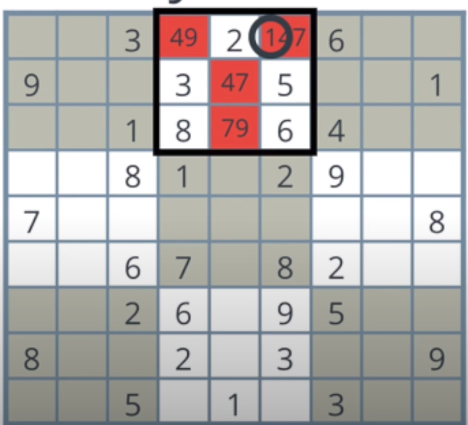
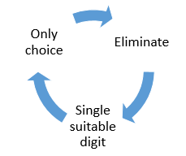

# Sudoku-AI-CSP-vs-Backtracking

- [Video link](https://youtu.be/AP__LKLhhuk)

This repository is about 2 AI algorithms in solving sudoku.

- Backtracking with Minimum Remaining Value Heuristic
- Using Constraint Propagation to solve CSP(Constraint Satisfaction Problem)

## 1. Backtracking with Minimum Remaining Value Heuristic

Backtracking is a really simple technique that solves a lot of problems. However, backtracking solvers tend to solve problems by searching for all the problem space, and they might check all cases to find the solution. They also consume a lot of time. The more complex the problem, the slower the solver becomes.

The backtracking algorithm is pretty simple. It is the same approach as it is used in the n-queen problem.

  

In Sudoku our initial condition is to find an empty cell (which is represented by ‘0’) in the table to fill it with a number. If it could not find an empty spot this means that the table is full and the problem is solved.

Whenever it finds an empty cell it will check that which number in the range 1 to 9 is safe to use in the cell. After finding the appropriate number it will fill the cell and call the backtracking function again to dive deeper into the tree in order to fill the next cell. This function call happens recursively at each step until the table is filled with numbers. At any point, if it cannot fill a cell with a number it will return to the previous cell and change that number to another valid choice.

### About the time complexity

With the backtracking the more complex the problem, the slower the solver becomes.
It happens because of the game tree. When problems getting bigger, the game tree is also getting bigger. Let's see the backtracking algorithm`s solving time in ms :

  

---

## 2. Using Constraint Propagation to solve CSP(Constraint Satisfaction Problem)

CSP stands for Constraint Satisfaction Problem. Therefore, our main goal to design such an algorithm is to satisfy all the well-defined constraints which the problem introduces.

### What are our main constraints?

The same single integer may not appear twice in the same row, column, or any of nine 3x3 subgrids of 9x9 playing board.

Firstly, let's assume that every cell has an arraylist or just list and this list contains suitable numbers for this cell. And we have to find a way to eliminate nonsuitable numbers or digits from this list and find a suitable one.

  

And we have to start to eliminate smartly these numbers, and in a couple of iterations, it will eliminate all non-suitable numbers from these cells` arraylists.

  

### And How this loop will be?

The first one is Eliminate function. This function basically eliminate the found numbers(cells) from the non found cells' arraylist or in another word, we will look for every found or known cell and try to remove this cell's value from the other cells' lists which are in the same row & column & 3x3 box.

  

### How does it work?

The algorithm will take a cell and look every row, column, and 3x3 box of this cell one by one. And initialize an arraylist and start to fill this list with the found values from this row, column, and 3x3 box.
After filling this list with according digits, the algorithm will delete these digits from the list of the main cell. In another word, eliminate numbers.

The second one is Single suitable digit function ( SingleCellDestroyer in code ). This function basically finds the cells that have :

  
  

After “destroying” these numbers, the algorithm has to step in a more clever way.

And 3rd and most important part of algorithm: Only Choice functions. They are 3 separate (for a row, column, and 3x3 box) functions, and they are working in the same logic functions. For example, let`s explain it on only_choice_row function. We will look at every non-found cell and take their suitable digit lists. And try to find a unique digit that can be only in one cell. When the algorithm tries to do this logic also in a row, column, and 3x3 box, solving sudoku is getting more fast and efficient.

This is an example that we have 4 non-found cells in the 3x3 box. They are:
           “ 4 9 ” – “ 4 7 ” – “ 7 9 “ – “ 1 4 7 “
And digit “1” can be in just one place. This is called the Only Choice method.

  

### How whole these 3 parts working together.

  

Firstly elimination part working to eliminate non-suitable digits. After it, single suitable digit function working to find cells and eliminate working again. After doing the best elimination, starting working with only_choice functions. Let`s see the code to understand the whole loop.

> This algorithm is almost 10x times faster than Backtracking.
